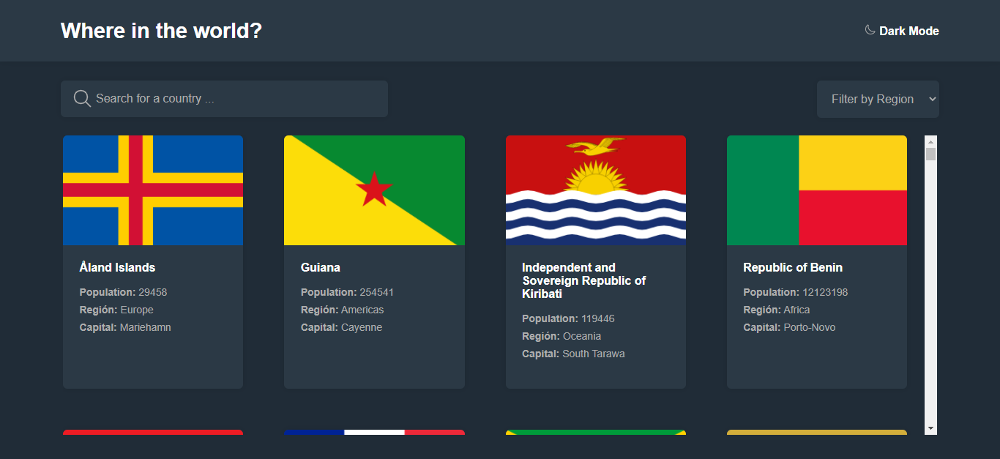

# SEARCH COUNTRIES

## This project is based on one of the [Frontend Mentor](https://www.frontendmentor.io/) challenges.



### [REST Countries API with color theme switcher](https://www.frontendmentor.io/challenges/rest-countries-api-with-color-theme-switcher-5cacc469fec04111f7b848ca)

# The challenge

- Challenge is to integrate with the REST Countries V2 API to pull country data and display it like in the designs.

- Users should be able to:

  - See all countries from the API on the homepage
  - Search for a country using an input field
  - Filter countries by region
  - Click on a country to see more detailed information on a separate page
  - Click through to the border countries on the detail page
  - Toggle the color scheme between light and dark mode (optional)

# Technologies used

- React + Context
- Sass
- Ionicons for icons

## Instalation

- It is important to have installed node

### Instalation modules

```
npm i
```

### Run application

```
npm start
```
